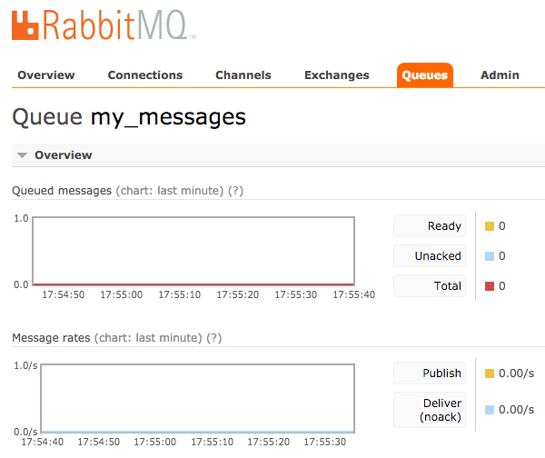

# Rabbit MQ POC

Simple POC using Rabbit MQ with Java

## About Rabbit MQ

See [Rabbit MQ website](https://www.rabbitmq.com/)

* Robust messaging for applications
* Easy to use
* Runs on all major operating systems
* Supports a huge number of developer platforms
* Open source and commercially supported

## Setting up Rabbit MQ on your local machine

1. Download [Rabbit MQ](https://www.rabbitmq.com/download.html) and create the environment variable **RABBITMQ_HOME** pointing to the folder. 

2. Start Rabbit MQ on localhost

	    ${RABBITMQ_HOME}/sbin/rabbitmq-server

    Rabbit MQ is now running on: [localhost:5672](http://localhost:5672/)

3. Creating the user and giving permissions:

	    rabbitmqctl add_user user password
	    rabbitmqctl set_user_tags user administrator
	    rabbitmqctl set_permissions -p / user ".*" ".*" ".*"
	
4. Install the management tool:
[Rabbit MQ Management Web Tool](https://www.rabbitmq.com/management.html)

	    rabbitmq-plugins enable rabbitmq_management

	[localhost:15672/](http://localhost:15672/)
	
	Now you can enter the tool and take a look to the Queues using the credentials created on the step before.
	
## Producing / Consuming

Execute the main method on the class **com.joantolos.rabbit.mq.producer.Producer**. It will create the queue named *my_messages* and add the message *Message on the queue from the Producer*. You can check the management tool on your browser to see the queue:

Then you execute the main method on the class **com.joantolos.rabbit.mq.consumer.Receiver**. It will consume the message on the queue *my_messages* and print it on the console. Then you can execute several times the Producer again and see how the consumer is listening to the queue.

## Work Queues

The main idea behind Work Queues (aka: Task Queues) is to avoid doing a resource-intensive task immediately and having to wait for it to complete. Instead we schedule the task to be done later. We encapsulate a task as a message and send it to a queue. A worker process running in the background will pop the tasks and eventually execute the job. When you run many workers the tasks will be shared between them.

This concept is especially useful in web applications where it's impossible to handle a complex task during a short HTTP request window.

## Publish / Subscribe

## Routing

## Topics

## RPC